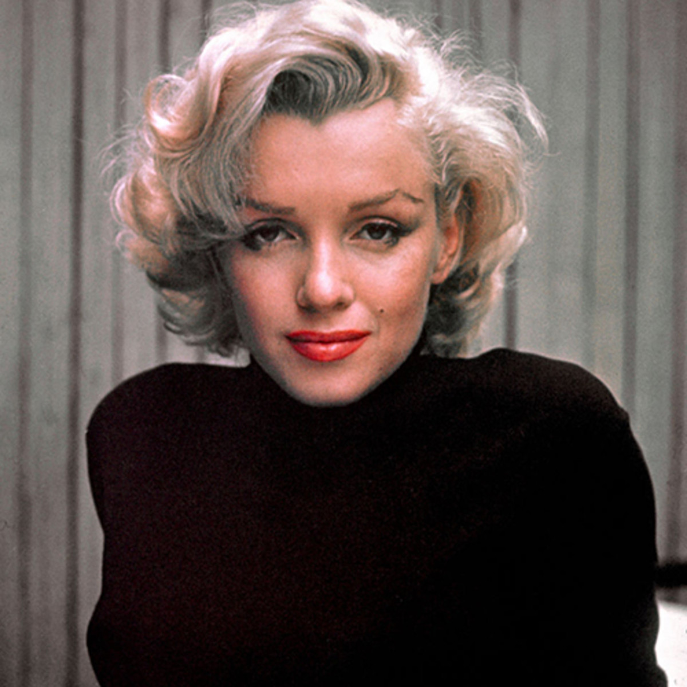

# Marilyn Monroe Biography

Marilyn Monroe (1926-1962) Model, actress, singer and arguably one of the most famous women of the twentieth century. Monroe has become an iconic representative of fame and female beauty. She is widely regarded as one of the most influential figures in American culture.
Monroe was born, Norma Jeane Mortenson, in June 1926. Her mother was Gladys Pearl Baker (née Monroe, 1902–84) Her father was unknown and she was baptised as Norma Jeane Baker. Her mother Gladys had a turbulent mental state and struggled to cope with bringing up her children. For the first six years, Marilyn was brought up by foster parents, Albert and Ida Bolender in the town of Hawthorne, California. Her mother then tried to take back Marilyn, but she suffered a mental breakdown and Marilyn was moved between different orphanages and foster homes. The traumatic childhood made her shy and reserved.
Just after her 16th birthday, in 1942, Monroe married her 21-year-old, next-door neighbour Jimmy Dougherty. Marilyn became a housewife, but the couple were not close, and Monroe reports being bored. In 1943, her husband left to join the Merchant Marines to participate in America’s War effort. They split up shortly after.
To earn a living, Marilyn took a job at a local munitions factory in Burbank, California. It was here that Marilyn got her first big break. Photographer David Conover was covering the munitions factory to show women at work for the War effort. He was struck by the beauty and photogenic nature of Norma, and he used her in many of his photographs. This enabled her to start a career as a model, and she was soon featured on the front of many magazine covers.
1946 was a pivotal year for Marilyn, she divorced her young husband and changed her name from, the boring, Norma Baker to the more glamorous Marilyn Monroe (after her grandma). She took drama lessons and got her first movie contract with Twentieth Century Fox. Her first few films were low key, but from these beginnings, it gained her more prominent roles in films such as All About Eve, Niagara and later Gentleman Prefer Blondes and How To Marry A Millionaire.
These successful film roles thrust her into the global limelight. She became an iconic figure of Hollywood glamour and fashion. She was an epitome of sensuality, beauty and effervescence and was naturally photogenic. But she often found the trappings of fame difficult to deal with.
In 1954, she married baseball star Joe DiMaggio, a friend of over two years. Monroe was now one of the biggest box-office draws of Hollywood, but her contract, negotiated in 1950, left her paid less than other stars. Also, Monroe didn’t wish to be typecast as a ‘blonde bombshell’ – just playing simple roles in comedies and musicals. In a dispute over pay and choice of acting, she was temporarily suspended by 20th Century Fox, but eventually, they acceded to some of Monroe’s demands and gave her higher pay. In September 1954, she starred in The Seven Year Itch, which was released to widespread media interest – after a successful media stunt on Lexington Avenue, New York.
Monroe-marilyn-In 1955, she sought greater independence from Fox, and began her own movie production and began studying method acting. Despite the media often being dismissive of Monroe’s potential, her efforts to improve acting paid off, and later films received critical acclaim for her wider scope of acting. She was nominated for Golden Globe Best Actress Award for Bus Stop (1956). In 1959, she won a Golden Globe for her role in ‘Some Like It Hot‘.
Her relationship with Joe DiMaggio was quickly strained, due to his jealous and controlling nature. Monroe soon filed for divorce, though the couple retained a friendship despite the divorce. Monroe began dating playwright Arthur Miller and in 1956 married. To get married, Monroe converted to Judaism. The marriage received significant media interest for the combination of Miller the left-wing intellectual and Monroe, the perceived ‘dumb blonde’.  The marriage was sometimes referred to, rather unkindly, as “Egghead Weds Hourglass”.

